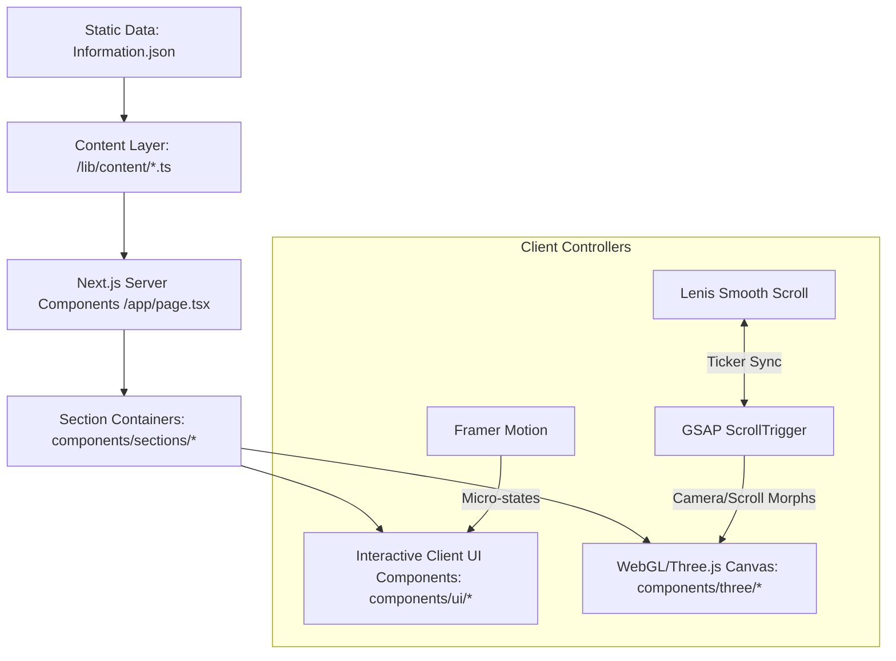
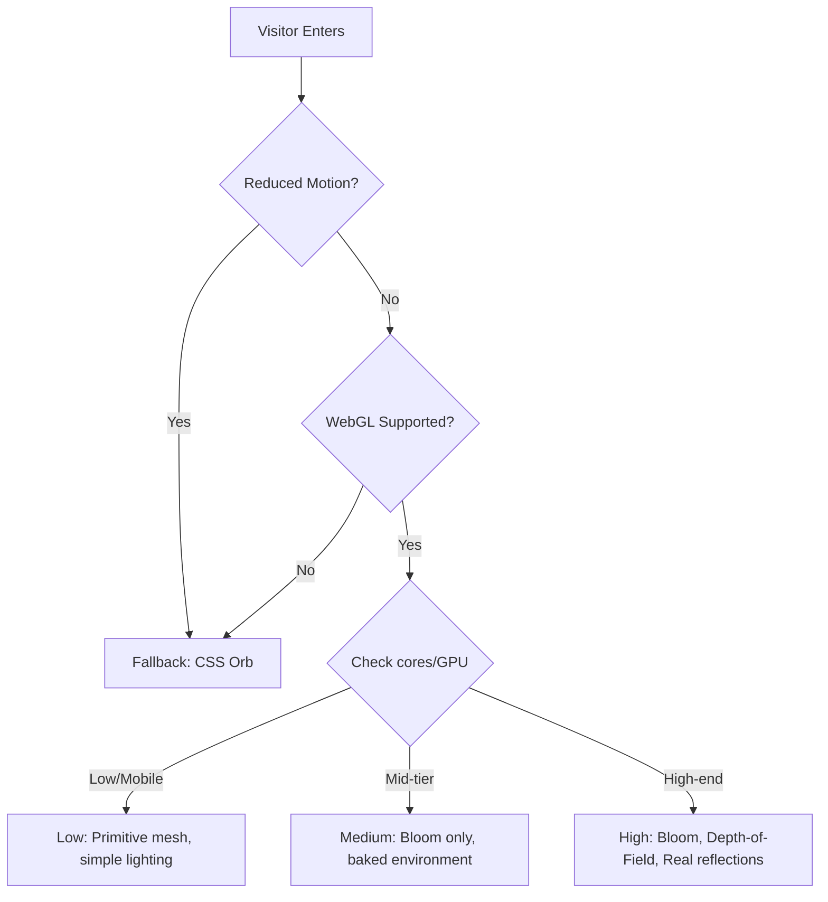

# System Architecture — Premium Cinematic Portfolio Website

This document specifies the technical architecture, data flow, component contracts, and implementation blueprints for the Next.js Cinematic Portfolio, as derived from [context.md](file:///c:/Users/delap/Angular-Portfolio/context/context.md) and backed by [Information.json](file:///c:/Users/delap/Angular-Portfolio/context/Information.json).

---

## 1. Architectural Overview

The application is structured as a **single-page Next.js App Router application**, designed to combine ultra-premium visual aesthetics (WebGL/3D, GSAP animations, glassmorphism) with strict accessibility (WCAG 2.2 AA) and performance standards (≥30 FPS mobile floor, zero layout shifts).



### 1.1 Key Architecture Goals
- **Strict Content/Presentation Split**: All texts, jobs, and links reside in `/lib/content/` (populated from `Information.json`). Editing components is never required to update personal details.
- **Hydration & LCP Performance**: Above-the-fold content (Hero texts, Nav) is pure HTML/CSS, rendering instantly. Heavy 3D assets and animation scripts load asynchronously without blocking the Largest Contentful Paint (LCP).
- **Graceful Degradation**: Core sections remain fully functional without Javascript or WebGL, collapsing into high-end CSS radial gradient layouts.

---

## 2. Technical Stack & Libraries

| Dependency | Purpose | Integration Pattern |
|---|---|---|
| **Next.js 15+ (App Router)** | Base Framework | App Router, Server Components by default; client components (`"use client"`) at interactive leaves. |
| **React 19** | Rendering Engine | Utilizes React 19's native server actions and hydration optimizations. |
| **Tailwind CSS v4** | CSS utility engine | Configured using design token CSS variables in `@/styles/tokens.css`. |
| **Three.js & R3F** | 3D Graphics | Managed via React Three Fiber (`@react-three/fiber`) and `@react-three/drei`. |
| **GSAP + ScrollTrigger** | Scroll animations | Drives camera paths and section-based 3D object coordinate morphs. |
| **Framer Motion** | Micro-interactions | Page entry reveals, button hover/tap states, modal/menu animations. |
| **Lenis** | Smooth scrolling | Root-level scrolling manager synced with GSAP. |
| **React Intersection Observer** | Section loading | Controls entry triggers and lazy-mounting of heavy WebGL content. |

---

## 3. Directory Structure

The workspace follows a strict folder structure to maintain clean boundaries between UI elements, 3D canvas objects, and data:

```
/context
  ├── context.md              # Master specification & tokens
  ├── Information.json        # Extracted source data
  └── architecture.md         # This technical specification

/public                       # Static assets (images, PDFs, SVGs)
  ├── Calculator.png
  ├── GuestGuru.jpg
  ├── bank.png
  ├── anshu-profile.png
  └── Ansar-Bux-Software-Engineer.pdf


/src
  ├── /app
  │     ├── layout.tsx        # App wrapper, global fonts, SmoothScrollProvider
  │     ├── page.tsx          # Single-page layout containing sections
  │     └── globals.css       # Tailwind imports + token-variable hooks
  │
  ├── /components
  │     ├── /layout           # Global shell components
  │     │     ├── Navbar.tsx
  │     │     ├── Footer.tsx
  │     │     ├── CustomCursor.tsx
  │     │     └── SmoothScrollProvider.tsx # GSAP + Lenis integration
  │     │
  │     ├── /three            # WebGL / R3F components
  │     │     ├── Hero3DObject.tsx
  │     │     ├── SceneEnvironment.tsx
  │     │     ├── CanvasFallback.tsx     # Non-WebGL visual alternative
  │     │     └── useDeviceTier.ts       # Device capability assessment
  │     │
  │     ├── /sections         # Modular page sections
  │     │     ├── Hero.tsx
  │     │     ├── About.tsx
  │     │     ├── Skills.tsx
  │     │     ├── Experience.tsx
  │     │     ├── Services.tsx
  │     │     ├── Testimonials.tsx
  │     │     ├── /projects
  │     │     │     ├── FeaturedProjects.tsx
  │     │     │     ├── HorizontalProjectsGallery.tsx
  │     │     │     └── ProjectCard3D.tsx
  │     │     └── /contact
  │     │           └── ContactForm.tsx
  │     │
  │     └── /ui               # Atomic styling components
  │           ├── MagneticButton.tsx
  │           ├── GlassPanel.tsx
  │           ├── SectionReveal.tsx
  │           ├── SplitText.tsx
  │           ├── ProgressIndicator.tsx
  │           └── Badge.tsx
  │
  ├── /lib
  │     ├── /animation        # Motion helper hooks
  │     │     ├── easings.ts
  │     │     └── useReducedMotion.ts
  │     ├── /content          # Typings & JSON mapping adapters
  │     │     ├── profile.ts
  │     │     ├── projects.ts
  │     │     ├── experience.ts
  │     │     └── testimonials.ts
  │     └── /utils            # Utility functions
  │           └── cn.ts       # clsx + tailwind-merge helper
  │
  └── /styles
        └── tokens.css        # All CSS custom properties from §3
```

---

## 4. Key Architectural Subsystems

### 4.1 Lenis + GSAP ScrollTrigger Integration
To prevent animation stutter and layout desync, Lenis and GSAP ScrollTrigger share the same requestAnimationFrame (rAF) loop.
```typescript
// Location: components/layout/SmoothScrollProvider.tsx
import { useFrame } from '@react-three/fiber'; // if inside canvas, else custom requestAnimationFrame
import lenis from '@studio-freight/lenis';
import { gsap } from 'gsap';
import { ScrollTrigger } from 'gsap/ScrollTrigger';

// Bridge pattern:
gsap.registerPlugin(ScrollTrigger);
const lenisInstance = new lenis({
  lerp: 0.1,
  syncTouch: true,
});

// Update ScrollTrigger on every Lenis scroll event
lenisInstance.on('scroll', ScrollTrigger.update);

// Drive Lenis from the GSAP ticker
gsap.ticker.add((time) => {
  lenisInstance.raf(time * 1000);
});
```

### 4.2 WebGL Device Tiering Strategy
To meet the performance budget (60 FPS on desktop, ≥30 FPS on mobile), we inspect GPU Capabilities client-side before rendering the `Canvas`.

```typescript
// Location: components/three/useDeviceTier.ts
export type QualityTier = 'high' | 'medium' | 'low' | 'fallback';

export function useDeviceTier(): QualityTier {
  // 1. Check prefers-reduced-motion -> returns 'fallback'
  // 2. Check navigator.hardwareConcurrency < 4 -> returns 'low'
  // 3. WebGL support check -> if absent, returns 'fallback'
  // 4. Fine-grained check via detectGPU: returns 'high' (Bloom+DoF), 'medium' (Bloom only), or 'low' (simple shaders)
}
```



### 4.3 Accessibility (a11y) Boundary Layer
All Three.js elements are treated as purely decorative. The Canvas is isolated from the assistive technology tree using `aria-hidden="true"`.
All critical information is rendered as native accessible HTML overlaid via absolute positioning or layout containers:

- **Interactive Nodes**: Focus rings (`outline-color.state.focus-ring`) are applied to every clickable project, button, or link.
- **Form validation**: Fields use native semantic labels, `aria-required`, and announcement zones (`aria-live="polite"`).

---

## 5. Design Token Implementation Schema

All semantic tokens from `context.md` map to CSS variables in `@/styles/tokens.css` and are consumed in `tailwind.config.ts`:

### 5.1 Color Mapping
```css
/* src/styles/tokens.css */
:root {
  --color-surface-base: #050505;
  --color-surface-raised: #0D0D0F;
  --color-surface-overlay: rgba(0, 0, 0, 0.7);
  --color-surface-glass: rgba(255, 255, 255, 0.04);
  
  --color-border-glass: rgba(255, 255, 255, 0.08);
  --color-border-strong: #1A1A1C;
  
  --color-text-primary: #FFFFFF;
  --color-text-secondary: #B8B8BC;
  --color-text-tertiary: #6E6E73;
  --color-text-inverse: #050505;
  
  --color-accent-gold: #C88B2B;
  --color-accent-gold-muted: rgba(200, 139, 43, 0.2);
  --color-accent-navy: #1F3356;
  --color-accent-navy-muted: rgba(31, 51, 86, 0.4);
  
  --color-state-success: #2BAA6B;
  --color-state-error: #D14B4B;
  --color-state-focus-ring: #C88B2B;
}
```

---

## 6. Data Adapters (Adapting Information.json)

The structured key-values in `Information.json` are exposed to Next.js components via a typed boundary layer in `src/lib/content/`:

```typescript
// Location: src/lib/content/profile.ts
import data from '../../../context/Information.json';

export interface PersonalInfo {
  name: string;
  title: string;
  email: string;
  phone: string;
  alternatePhone: string;
  birthday: string;
  location: {
    city: string;
    state: string;
    country: string;
    pincode: string;
    displayAddress: string;
    hometownContext: string;
  };
  profileImage: string;
  resumePdf: string;
}

export const personalInfo: PersonalInfo = {
  name: data.personal_info.name,
  title: data.personal_info.title,
  email: data.personal_info.email,
  phone: data.personal_info.phone,
  alternatePhone: data.personal_info.alternate_phone,
  birthday: data.personal_info.birthday,
  location: {
    city: data.personal_info.location.city,
    state: data.personal_info.location.state,
    country: data.personal_info.location.country,
    pincode: data.personal_info.location.pincode,
    displayAddress: data.personal_info.location.display_address,
    hometownContext: data.personal_info.location.hometown_context,
  },
  profileImage: data.personal_info.profile_image,
  resumePdf: data.personal_info.resume_pdf,
};
```
Similar adapters in `/lib/content/projects.ts`, `/lib/content/experience.ts` handle dynamic lists, formatting, and mappings safely.

---

## 7. Quality Assurance Targets & Acceptance Matrix

To verify that the implementation adheres to the architectural design, the following thresholds are audited:

| Component | Target Metric | Verification Method |
|---|---|---|
| **Whole App** | Lighthouse Performance ≥ 85 | Throttled Mobile Simulation in Chrome |
| **All Sections** | axe-core automated audit score = 100% | Integrated Axe scans |
| **Canvas** | Zero main thread blocking during LCP | DevTools CPU profiler |
| **3D Rendering** | Standard desktop FPS: 60, mobile FPS ≥ 30 | Three.js performance monitor |
| **Forms** | Keyboard-only submission cycle | Tab navigation check |
